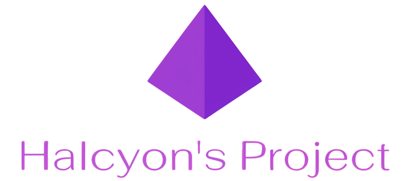
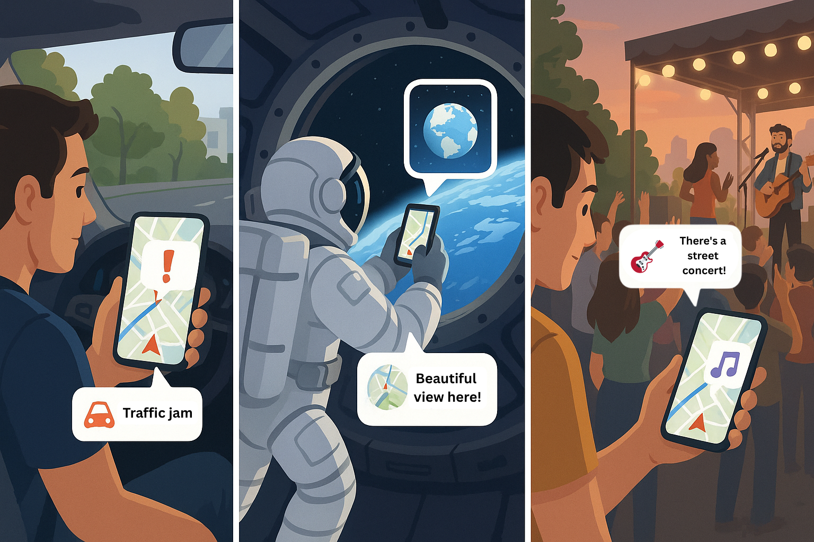

  

  

# Halcyon's Project: Інтерактивна RPG-гра на мапі

Ласкаво просимо до Halcyon's Project – веб-застосунку, що перетворює карту на віртуальний світ тісно пересікаючи реальний. Користувачі можуть досліджувати, створювати та взаємодіяти з точками інтересу, співпрацювати зі спільнотою для досягнення глобальних цілей та розвивати власну унікальну соціальну ідентичність.

---

## 🚀 Основний функціонал

### 👤 Керування користувачем

- **Автентифікація:** Безпечна реєстрація та вхід у систему.
- **Персоналізований профіль:**
  - Зміна аватара.
  - Перегляд особистої статистики (рівень, досвід).
  - Налаштування унікального кольору нікнейму.
- **Система рівнів та досвіду (XP):** Отримуйте досвід за активності на мапі та підвищуйте свій рівень.

### 🗺️ Взаємодія з мапою

- **Мітки (Placemarks):** Створюйте, редагуйте та видаляйте власні точки інтересу на мапі.
- **Маяки (Beacons):** Унікальна ігрова механіка, що вимагає від спільноти спільних зусиль для пошуку та активації.
- **Коментарі:** Залишайте коментарі до будь-якої мітки, діліться враженнями та порадами.
- **Кастомізація вигляду:**
  - **Теми:** Перемикайтеся між світлою, темною та скляною (glassmorphism) темами.
  - **Тип мапи:** Обирайте між стандартним виглядом та супутниковими знімками з написами або без.

### 🌐 Спільнота та взаємодія

- **Глобальний чат:** Спілкуйтеся з усіма гравцями онлайн в реальному часі.
- **Лічильник онлайну:** Завжди знайте, скільки гравців зараз у грі.
- **Спільний прогрес:** Відстежуйте прогрес спільноти у знаходженні та активації маяків.

### 🔮 У розробці та майбутні ідеї
- **Злиття в одну єдину ідею - взаємодія в реальному світі, в реальному часі.**
- **Колекціонування:** Механіка збору унікальних предметів або істот.
- **Розширена взаємодія:** Нові способи взаємодії між гравцями, окрім чату.

---

## 🛠️ Технологічний стек

| Категорія                     | Технологія                                                                                                                                          |
| -------------------------------------- | ------------------------------------------------------------------------------------------------------------------------------------------------------------- |
| **Бекенд**                 | **Django**, **Django REST Framework** (для API), **Django Channels** (для WebSockets), **Daphne** (ASGI сервер)           |
| **Фронтенд**             | **React**, **Vite** (швидке середовище розробки), **Axios** (для HTTP-запитів), **Google Maps API** |
| **База даних**          | **PostgreSQL**                                                                                                                                          |
| **Інфраструктура** | **Docker**, **Docker Compose** (для контейнеризації та легкого запуску всього проєкту)             |

---

## 📄 Ліцензія

Цей проєкт розповсюджується за ліцензією MIT. Детальніше дивіться у файлі `LICENSE`.
=======================================================================================================================================

Цей проєкт розповсюджується за ліцензією MIT. Детальніше дивіться у файлі `LICENSE`.

>>>>>>> 2399018064901302c8d7c3915db19446312dbc50
>>>>>>>
>>>>>>
>>>>>
>>>>
>>>
>>
